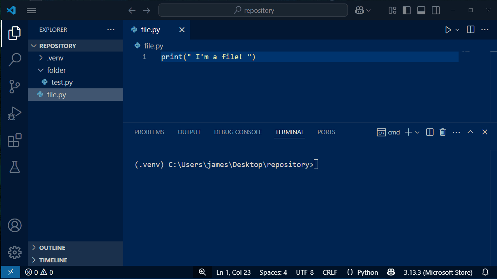
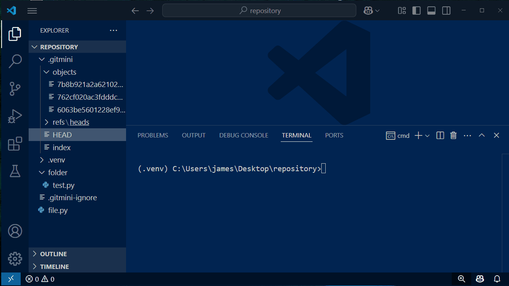
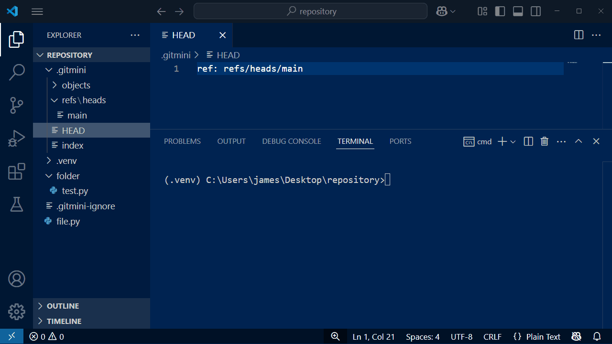
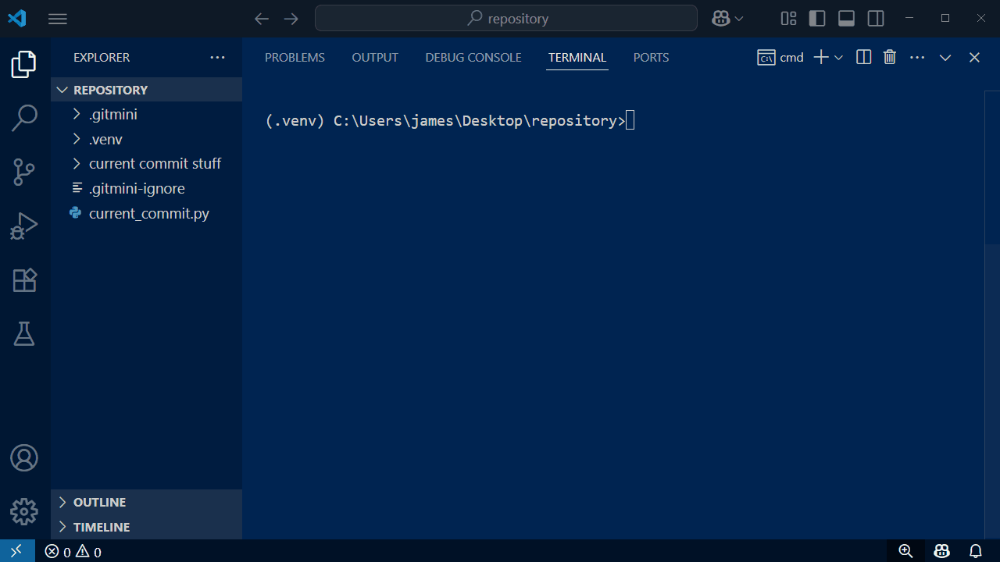
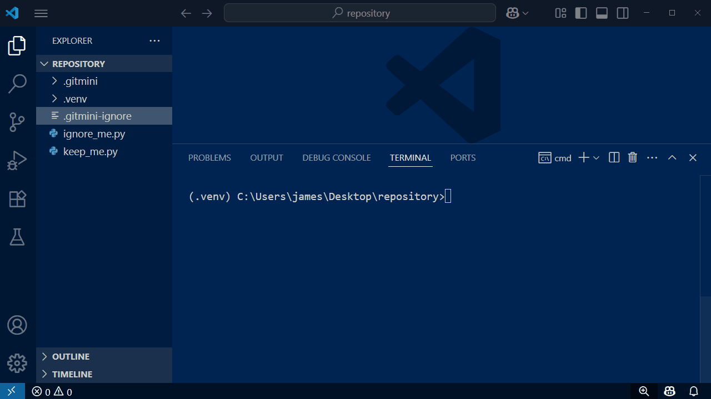

# GitMini


**GitMini** is a lightweight Version Control System built from scratch in Python. It replicates core non-remote Git commands like `init`, `add`, `commit`, `log`, `checkout`, and `branch`.

**NOTE!** This project is undergoing reconstruction, so it is missing some of its original files. I plan to add remote features, and because of this, I have made the core data structures of the project into its own python package in a seperate Git repository. This package "gitmini-core" will be a dependency for the "GitMini CLI" that you're looking at, as well as the "GitMini Remote Server" (think GitMiniHub).

⭐ This project has been uploaded to **PyPI**! Find the link here: https://pypi.org/project/gitmini/

---

## 💪 Motivation
* Exercise in-depth DSA and OOP practices.
* Demystify Git and learn safe Version Control principles.
* Deploy a real-world package to PyPI adhering to PEP standards.
* Practice safe SDLC methods and continuously test during development.
* Build a CLI tool from scratch.
* Learn to efficiently store and search data with hashing.

---

## 🛠️ Features & Demonstration

### Init and Add

* `gitmini init` - Initializes a new Gitmini repository. *(Creates .gitmini/ and .gitmini-ignore)*
     * `.gitmini/index` is the "staging area". It contains a mapping of the files in our repo.
     * `.gitmini/objects` is where the actual file's contents exist.
* `gitmini add` - Stages changes *(Tracks new files, deleted files, or modifications)*

In the Gif, you'll see me initialize a new repository, and then stage the files.

Watch as the `.gitmini/` folder is populated in real-time:



<hr style="height:1px; background-color:#ddd; border:none; margin:12px 0;" />

### Commit

* `gitmini commit` - Commits staged changes. *(This creates a "snapshot" of our codebase, which is useful for code versioning.)*
     * `.gitmini/HEAD` is updated to point to the branch where the commit was made
     * `.gitmini/refs/heads` contain each branch's most recent commit.
 
In the Gif, you'll see me committing our changes.

Watch as the `HEAD` and `main` branch pointer are updated:



<hr style="height:1px; background-color:#ddd; border:none; margin:12px 0;" />

### Branch and Checkout

* `gitmini branch` - Shows current branch or creates a new branch.
     * `gitmini branch` shows what branch you're on, using the `*` symbol.
     * `gitmini branch <branch-name>` Creates a new branch called <branch-name>.
* `gitmini checkout <branch-name>` - Switches to the specified branch or commit.
  

In the Gif, you'll see me list the current branch, create `new-branch`, then switch to it.

Watch as the `refs/heads` folder is populated with `new-branch`, and the `HEAD` file changes to point to `new-branch`:



<hr style="height:1px; background-color:#ddd; border:none; margin:12px 0;" />

### Log

* `gitmini log` - Shows history of commits
     * These commits can be `checked out` to if you want to revert changes.

In the Gif, you'll see me switch to an old commit, then return back to the most recent version.

Watch as each commit's contents are loaded into the codebase:



<hr style="height:1px; background-color:#ddd; border:none; margin:12px 0;" />

### Ignore file

* `.gitmini-ignore` - A list of files, folders, and filetypes to ignore from versioning.
     * This is useful for not tracking secret files, virtual environments, etc.
 
In the Gif, you'll see me add `ignore_me.py` to the `.gitmini-ignore` file.

Watch as I stage files, but `ignore_me.py` is not included.



---

## 📦 Installation and Usage

**Make sure to create and activate a Python virtual environment before anything.**

GitMini is meant to be run inside an activated virtual environment -- it doesn’t add itself to PATH globally.

1. Navigate into your desired directory, then create & activate your virtual environment
   
```
cd project-root
python -m venv .venv
.\.venv\Scripts\activate
```

2. Install 'gitmini' via pip

```
pip install gitmini
```

3. Initialize a GitMini repository.

```
gitmini init
```

This command will generate the repository (.gitmini/), and the .gitmini-ignore file

4. **Ensure that your virtual environment file is ignored** by adding it to the .gitmini-ignore file.

*If you do not do this, GitMini will track your venv, and the program could break.*

```
# Within .gitmini-ignore, type the following:
<your-virtual-environment>/
```

5. Create project files/folders as you please, then stage your changes.

*Any of the following commands can be used:*
```
# To add a specific file or folder:
gitmini add <file> <folder>

# To add all files in the repo: 
gitmini add .
```

6. Make your first commit!

```
gitmini commit -m "Initial commit"
```

And you're done! You can now freely use GitMini to track your files.

And just like Git, you can make a new `branch`, `checkout` to them, and view the commit `log`.

## 👤 Author

James David Furtado

jamesdfurtado@gmail.com

https://www.linkedin.com/in/james-furtado/

## 📄 License
MIT License. See LICENSE file for details.
