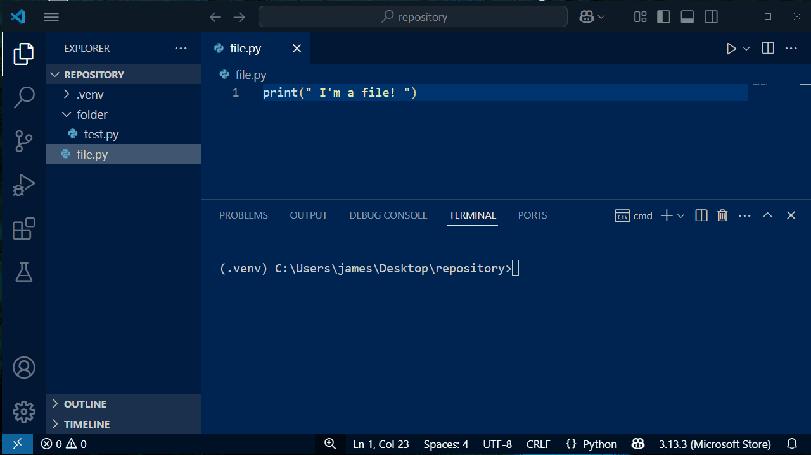
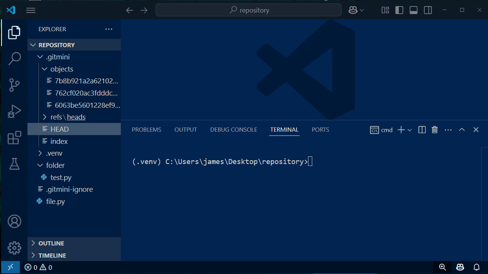
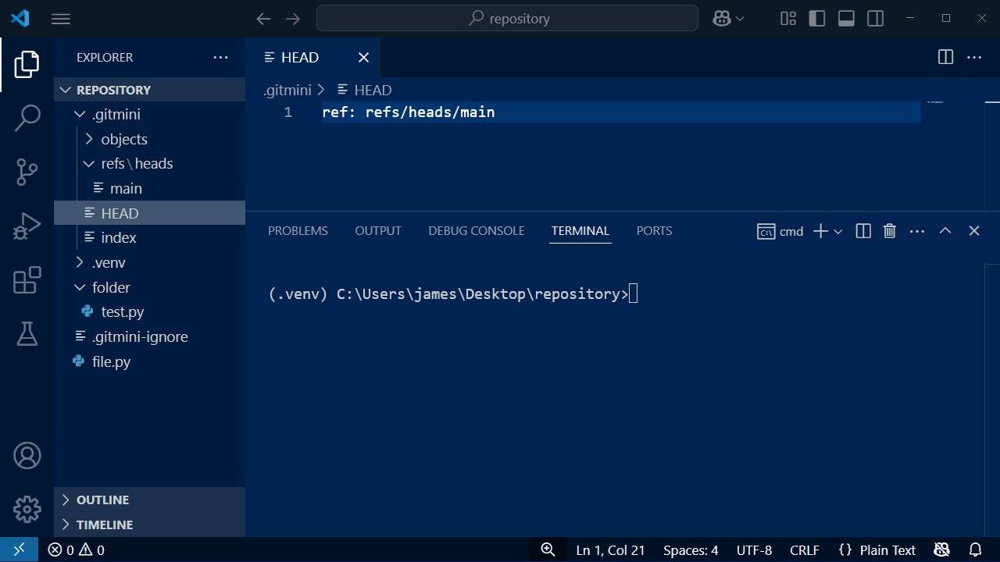
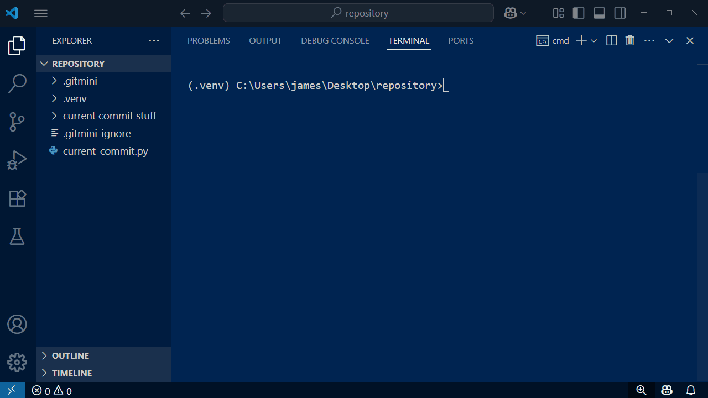
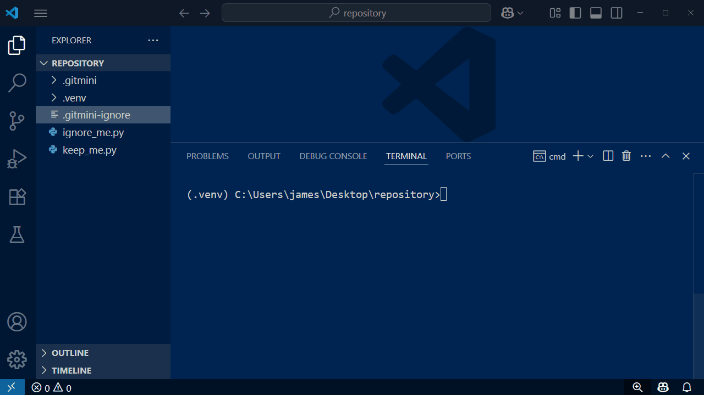

# GitMini

**GitMini** is a lightweight, pip-installable CLI version control system built from scratch in Python.
It supports core Git commands: `init`, `add`, `commit`, `log`, `checkout`, `branch`

I built this project to: 
* understand Git's core system architecture.
* build a CLI tool from scratch.
* build a complex, object-oriented, modular system.

The data structures that powers this CLI can be found here: https://github.com/jamesdfurtado/gitmini-core

⭐ This project has been uploaded to **PyPI**! Find the link here: https://pypi.org/project/gitmini/

---

## 🛠️ Features & Demonstration

### Init and Add

* `gitmini init`
* `gitmini add`

Watch as the `.gitmini/` folder is populated in real-time:

### Commit

* `gitmini commit`

Watch as the `HEAD` and `main` branch pointer are updated:

### Branch and Checkout

* `gitmini branch`
* `gitmini checkout <branch-name>`

Watch as the `refs/heads` folder is populated with `new-branch`, and the `HEAD` file changes to point to `new-branch`:

### Log

* `gitmini log`

Watch as each commit's contents are loaded into the codebase:

### Ignore file

* `.gitmini-ignore`

Watch as I stage files, but `ignore_me.py` is not included.

---

## 👤 Author

James David Furtado

jamesdfurtado@gmail.com

https://www.linkedin.com/in/james-furtado/

## 📄 License
MIT License. See LICENSE file for details.
